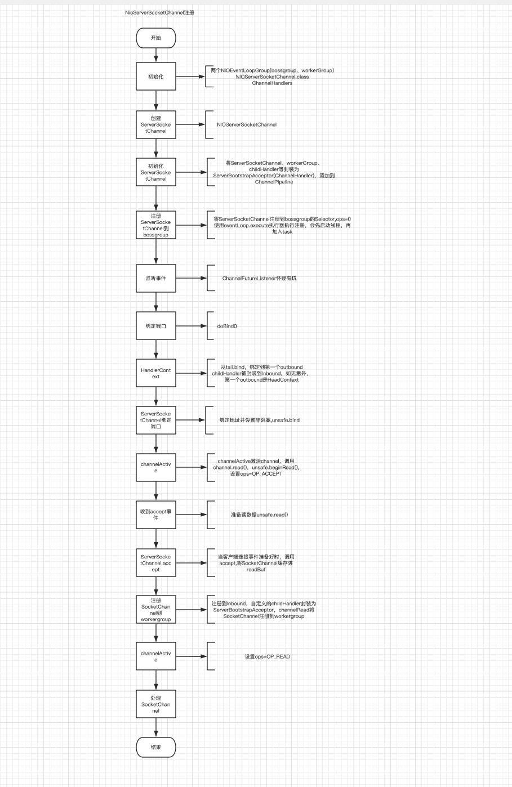
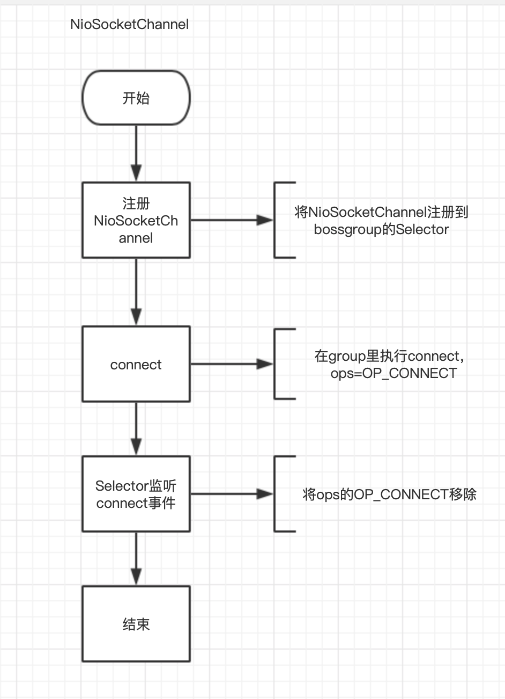

# NioServerSocketChannel流程图

# NioSocketChannel流程图

- Nio是异步的，也就是write后不会等返回。所以监听动作是交给自定义ChannelHandler处理的。服务器监听到read事件，执行其自定义ChannelHandler逻辑，如果是双通，会执行write写回结果。但是此刻客户端是异步的，不能阻塞获取结果。
- 所以此时客户端也监听read事件，执行其自定义ChannelHandler逻辑。参考dubbo的DefaultFuture实现，在客户端发起write时，会记录一个id，自定义ChannelHandler处理时，会找到对应的DefaultFuture，写入结果。调用方持有DefaultFuture，等待response写入值